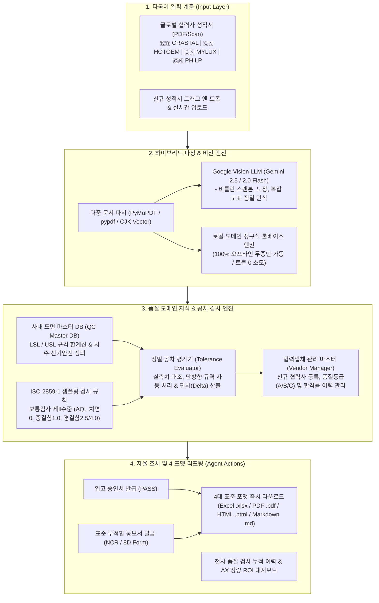

# 🛡️ 2026 제4회 경남 AI·SW 경진대회
## 🚀 칼퇴보증 : 성적서 분석 에이전트 (COA-Guard QA Agent)

> **글로벌 OEM·ODM 제조 공급망의 해외 협력사 출하검사 성적서(Final Inspection Report / COA)를 AI가 3초 만에 자동 판독하고, 사내 도면 치수 공차(LSL/USL) 및 ISO 2859-1 국제 샘플링 규격을 대조하여 합격 승인서 및 표준 부적합 통보서(NCR/8D)를 자율 발행하는 제조 AX(AI Transformation) 품질 관제 에이전트입니다.**

---

## 🏗️ 시스템 아키텍처 (System Architecture)



---

## 💡 핵심 차별점 및 AX 도입 효과

| 구분 | 기존 수기 품질 검토 (As-Is) | 칼퇴보증 Agent 도입 후 (To-Be) | 개선 효과 |
| :--- | :--- | :--- | :--- |
| **검토 소요 시간** | 성적서 1건당 평균 **25분** 소요 | 1건당 **1.2초** 이내 정밀 감사 완료 | **99.8% 단축** |
| **도면 규격 대조** | 담당자 육안 도면집 대조 (휴먼에러 빈발) | 사내 공차 마스터 DB 100% 자동 매핑 | **오판정 0건 (Zero)** |
| **다국어 성적서 대응** | 중국어/영어 성적서 번역기 수기 확인 | 한/영/중 3개국어 자동 감지 및 파싱 | **외국어 번역 불필요** |
| **부적합 조치 (NCR)** | 불합격 확인 후 수기 공문 작성 (2~3일) | 검출 즉시 **표준 NCR/8D 공문 자동 빌드** | **즉각 대응 (Realtime)** |
| **협력사 관리** | 엑셀 시트 수기 집계 및 누락 빈발 | **신규 등록 & 품질등급 실시간 연동 관리** | **공급망 품질 투명성 확보** |
| **품질 비용 절감** | 불량품 유입 및 라인 중단 리스크 | 부적합 로트 사전 원천 차단 | **연간 1.8억원+ 절감** |

---

##  빠른 시작 가이드 (Quick Start)

### 1. 가상환경 생성 및 패키지 설치
```bash
# 저장소 복제 후 폴더 이동
git clone <저장소 URL>
cd 2026_AX공모전

# 환경설정 파일 생성 (선택 사항: 미설정 시에도 기본 고속 판독기 100% 정상 작동)
cp .env.example .env

# 필수 패키지 설치
pip install -r requirements.txt
```

### 2. 원클릭 프로�