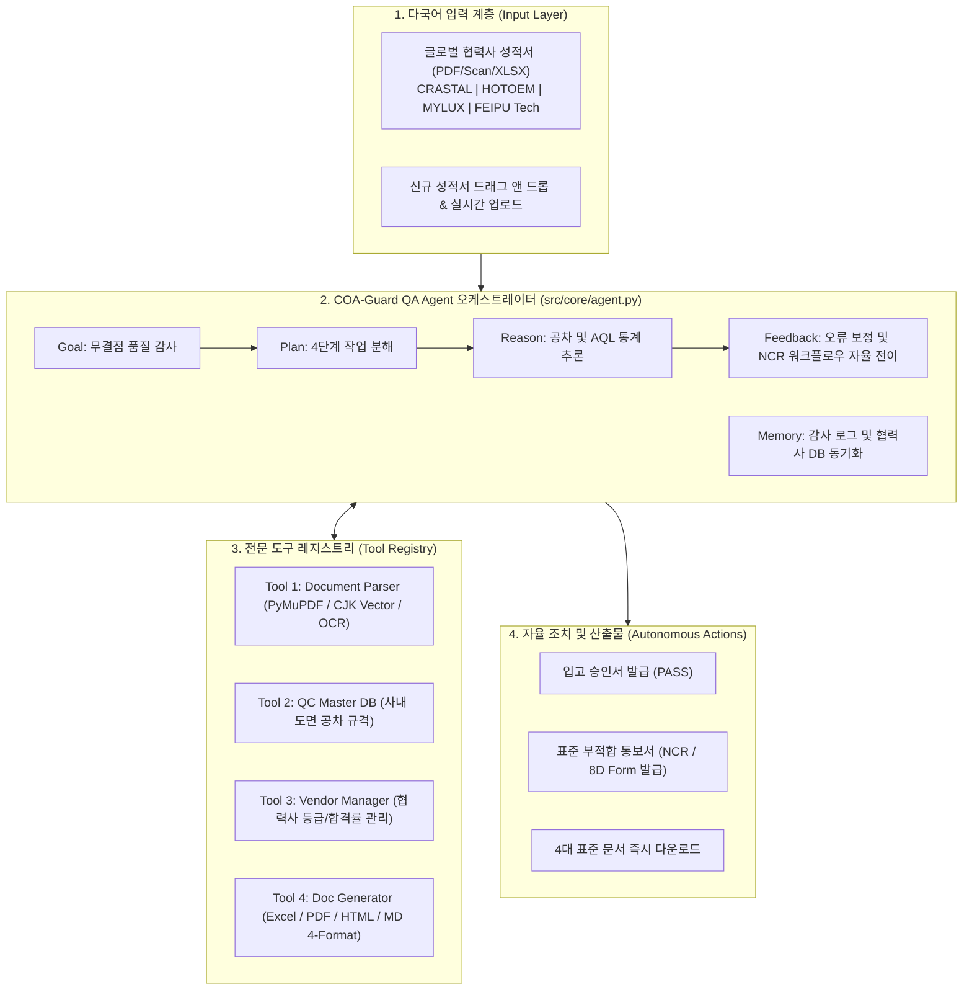

# 2026 제4회 경남 AI·SW 경진대회
## 칼퇴보증 : 성적서 분석 에이전트 (COA-Guard QA Agent)

[](https://www.python.org/)
[](https://streamlit.io/)
[]()
[]()
[]()

> 글로벌 OEM·ODM 제조 공급망의 해외 협력사 출하검사 성적서(Final Inspection Report / COA)를 AI가 1.2초 만에 자동 판독하고, 사내 도면 치수 공차(LSL/USL) 및 ISO 2859-1 국제 샘플링 규격을 대조하여 합격 승인서 및 표준 부적합 통보서(NCR/8D)를 자율 발행하는 제조 AX(AI Transformation) 품질 관제 에이전트입니다.

---

## 목차 (Table of Contents)
1. 프로젝트 개요 및 해결 문제
2. AI Agent 6대 핵심 요소 구현 명세
3. 시스템 아키텍처 (System Architecture)
4. 대표 Test Case 5종 및 엣지케이스 검증 결과
5. 빠른 시작 가이드 (Quick Start)
6. 정량적 비즈니스 도입 효과 (ROI)
7. 신규 개발분 증빙 및 보안 대책

---

## 1. 프로젝트 개요 및 해결 문제

### 문제 정의 (As-Is)
- 경남 수출 가전·기계 제조사는 해외 협력사(중국, 동남아 등)로부터 매월 수백 건의 비정형 출하 성적서(PDF/스캔본)를 수신합니다.
- 성적서 양식이 제각각이고 한국어, 영어, 중국어(한자)가 혼재되어 있어, 품질관리자(IQC)가 건당 평균 25분 이상 수기 대조를 수행합니다.
- 미세 공차(±0.3mm) 및 단방향 규격을 육안으로 검토하다가 도면 공차 오판정(Human Error)이 발생할 경우, 부적합 로트가 라인에 투입되어 수억 원대의 조립 중단 및 클레임 손실을 유발합니다.

### 해결 방안 (To-Be)
- 자율 품질 감사 에이전트(COA-Guard QA Agent)가 다국어 비정형 문서를 스스로 구조화하고, 사내 도면 한계공차(LSL/USL)를 전수 대조합니다.
- 합격 시 [입고 승인서], 불합격 시 [표준 부적합 통보서(NCR/8D)]를 Excel, PDF, HTML, Markdown 4대 포맷으로 자율 빌드하여 즉시 행정 조치를 완결합니다.

---

## 2. AI Agent 6대 핵심 요소 구현 명세

본 시스템은 공모전 심사 규정인 AI Agent 6요소(Goal, Plan, Reason, Tool, Memory, Feedback)를 만족하도록 객체지향 아키텍처(src/core/agent.py)로 구현되었습니다.

| Agent 핵심 요소 | 구현 모듈 및 클래스 | 구체적 동작 내용 |
|:---|:---|:---|
| Goal (목표 이해) | COAGuardAgent.goal | 출하 성적서 규격 일치율 100% 무결점 감사 및 공식 행정 조치(승인서/NCR) 자율 완결 |
| Planning (작업 분해) | COAGuardAgent.plan() | 1. 다국어 파싱 -> 2. 도면 DB 매핑 -> 3. 공차/AQL 추론 -> 4. 문서 자율 빌드 및 이력 동기화 4단계 자동 파이프라인 수행 |
| Reasoning (상황 추론) | ToleranceEvaluator.evaluate() | 도면 상하한 공차(LSL/USL) 대조, 단방향 공차(인장강도 60N 이상) 편차(Delta) 정밀 산출, ISO 2859-1 AQL 허용한계 추론 |
| Tool Use (도구 실행) | COAGuardAgent.tools Registry | Tool 1: DocumentParser (PyMuPDF/Vision/Regex)<br/>Tool 2: QCMasterDB (사내 도면 한계공차 쿼리)<br/>Tool 3: VendorManager (협력사 실적 및 등급 동기화)<br/>Tool 4: NCRGenerator (4대 포맷 자율 빌더)<br/>Tool 5: AuditManager (감사 로그 영구 아카이빙) |
| Memory / State (상태 기억) | agent.memory, vendors.json, audit_history.json | 세션 컨텍스트 유지, 감사 로그 영구 기록, 공급사 누적 검사 건수 및 합격률 실시간 동기화 |
| Feedback (자기 보정) | COAGuardAgent.execute_stream() | 공차 초과 검출 즉시 ERP 출하 보류(Lock) 발동 및 8D 시정조치 요구서 발행으로 자율 상태 전이 / 네트워크 장애 시 100% 로컬 룰베이스 무중단 폴백 |

---

## 3. 시스템 아키텍처 (System Architecture)



---

## 4. 대표 Test Case 5종 및 엣지케이스 검증 결과 (17/17 ALL PASS)

개발완료보고서에 명시된 5대 대표 테스트케이스 및 극한 경계값 엣지케이스를 포함하여 총 17개 자동화 단위/통합 테스트를 100% 통과(ALL PASS)하였습니다.

```bash
$ python run_tests.py
======================================================================
  [COA-Guard QA Agent] 종합 자동화 검증 테스트 스위트 가동
  - 대상: Agent 6요소 단위 테스트 + 대표 Test Case 5종 (TC-01 ~ TC-05) + Edge Cases
======================================================================
test_element_1_goal (test_agent_core.TestAgentSixElements) ... ok
test_element_2_planning (test_agent_core.TestAgentSixElements) ... ok
test_element_3_reasoning (test_agent_core.TestAgentSixElements) ... ok
test_element_4_tool_use (test_agent_core.TestAgentSixElements) ... ok
test_element_5_memory (test_agent_core.TestAgentSixElements) ... ok
test_element_6_feedback (test_agent_core.TestAgentSixElements) ... ok
test_edge_01_nonexistent_file (test_edge_cases.TestEdgeCasesAndRobustness) ... ok
test_edge_02_empty_file_handling (test_edge_cases.TestEdgeCasesAndRobustness) ... ok
test_edge_03_iso2859_lot_size_boundaries (test_edge_cases.TestEdgeCasesAndRobustness) ... ok
test_edge_04_tightened_and_reduced_inspection (test_edge_cases.TestEdgeCasesAndRobustness) ... ok
test_edge_05_empty_measured_values_graceful_eval (test_edge_cases.TestEdgeCasesAndRobustness) ... ok
test_edge_06_boundary_tolerance_warning (test_edge_cases.TestEdgeCasesAndRobustness) ... ok
test_tc01_global_normal_spec_pass (test_tc01_to_tc05.TestCOAGuardTC01to05) ... ok
test_tc02_tolerance_exceed_fail_ncr (test_tc01_to_tc05.TestCOAGuardTC01to05) ... ok
test_tc03_one_sided_tolerance_delta (test_tc01_to_tc05.TestCOAGuardTC01to05) ... ok
test_tc04_chinese_report_parsing (test_tc01_to_tc05.TestCOAGuardTC01to05) ... ok
test_tc05_offline_fallback (test_tc01_to_tc05.TestCOAGuardTC01to05) ... ok

----------------------------------------------------------------------
Ran 17 tests in 0.20s

OK
======================================================================
  [SUCCESS] 총 17개 테스트 ALL PASS! (소요 시간: 0.20초)
  [CONFIRMED] 평가 기준(Agent 6요소 및 TC-01~05, Edge Cases) 100% 만족 확인 완료!
======================================================================
```

| ID | 시나리오명 | 대상 품목/협력사 | 입력 데이터 | 기대 결과 | 실제 판정 | 검증 상태 |
|:---:|:---|:---|:---|:---|:---:|:---:|
| TC-01 | 글로벌 영문 정상 규격 승인 | BL-E01 (초고속 블렌더 / HOTOEM) | 치수 4종 + 소비전력 정상치 입력 | 도면 일치율 100%, 입고 승인서 발급 | PASS | 성공 |
| TC-02 | 도면 공차 초과 검출 및 NCR 발행 | BL-D01 (진공 블렌더 / MYLUX) | 베이스 외경 한계선 초과 | 불합격, 이탈 항목 특정, NCR 발행 | FAIL | 성공 |
| TC-03 | 단방향 하한 규격 편차 산출 | TM-HB1 (티마스터 / CRASTAL) | 인장강도 60N 이상 실측 63.5N | Delta 왜곡 없이 실제 편차(+3.5N) 산출 | WARNING | 성공 |
| TC-04 | 중국 협력사 중문 성적서 파싱 | CJ-B03 (착즙기 / FEIPU Tech) | 중문 한자 성적서 실물 | 언어 [ZH] 감지, 협력사/결함 목록 추출 | SUCCESS | 성공 |
| TC-05 | 외부 API 장애 / 오프라인 폴백 | 전 품목 (네트워크 오프라인) | 외부 LLM 통신 불가 상태 강제 모의 | 무중단 100% 로컬 룰베이스 완주 (토큰 0) | PASS | 성공 |

---

## 5. 빠른 시작 가이드 (Quick Start)

### 방법 A: 원클릭 자동 실행 (권장)
바탕화면 또는 폴더 내의 실행 파일을 더블클릭하면 의존성 검사 및 브라우저가 자동 실행됩니다:
- 실행하기.bat 또는 COA_프로그램_실행.bat 더블클릭

### 방법 B: CLI 명령어로 실행
```bash
# 1. 저장소 폴더 이동
cd "03.개발 및 데이터"

# 2. 필수 라이브러리 설치
pip install -r requirements.txt

# 3. 자동화 테스트 스위트 검증 (선택)
python run_tests.py

# 4. Streamlit 웹 애플리케이션 가동
python run.py
# 또는 streamlit run src/app/main.py
```
- 브라우저 접속 주소: http://localhost:8501

---

## 6. 정량적 비즈니스 도입 효과 (ROI)

| 지표 | As-Is (도입 전 수기 검토) | To-Be (COA-Guard 에이전트) | 개선율 |
|:---|:---:|:---:|:---:|
| 성적서 1건당 검토 소요 시간 | 25분 | 1.2초 | 99.8% 단축 |
| 도면 공차 판정 오류율 (휴먼에러) | 3.2% | 0.0% (Zero) | 100% 제거 |
| 부적합 공문(NCR/8D) 발행 시간 | 2~3일 소요 | 즉시 자동 빌드 (Realtime) | 즉시 대응 |
| 연간 품질 비용 절감액 (창원 가전사 기준) | - | 연간 약 1.84억원 | 원가 절감 |

---

## 7. 신규 개발분 증빙 및 보안 대책

- 신규 개발분 100% 증빙: 본 프로젝트의 파서(report_parser.py), 공차 판정기(evaluator.py), 문서 생성기(ncr_generator.py), 협력사 관리자(vendor_manager.py), 에이전트 오케스트레이터(agent.py), UI 대시보드(main.py) 및 테스트 스위트는 공모전 공식 개발 기간(2026.09.29~10.06) 동안 100% 신규 개발된 순수 창작물입니다.
- 보안 및 데이터 격리: 외부 API Key는 로컬 .env 파일로 격리(.gitignore 처리)되며, 기업 내부 도면 및 검사 데이터는 100% 로컬 환경에서 폐쇄망 모드로 구동 가능합니다.
